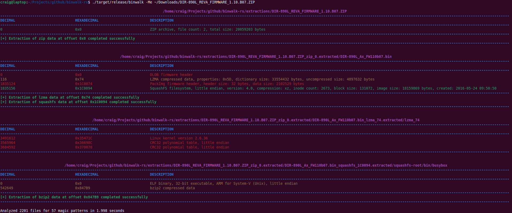
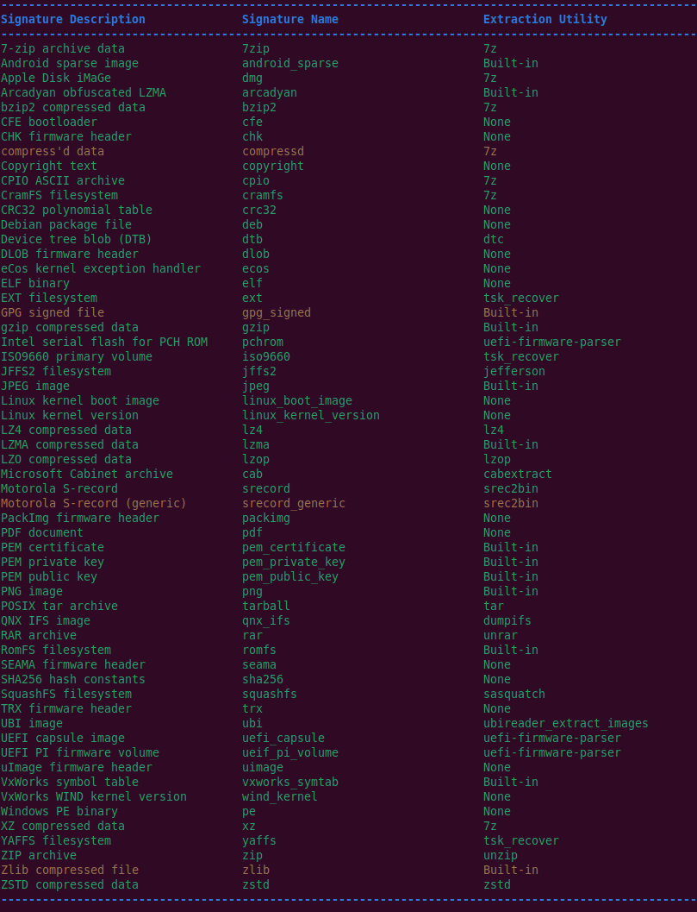
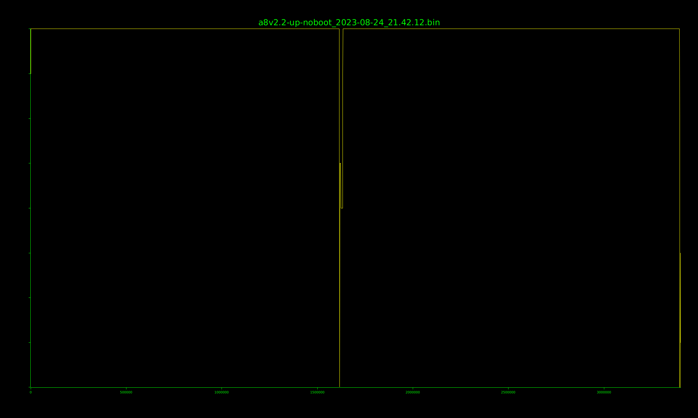

# Binwalk v3



## About

This is an updated version of the Binwalk firmware analysis tool. It has been re-written in Rust, and is currently considered unstable/experimental.

While the usage and output is similar to that of previous Binwalk releases, this version has several notable improvements:

### Smart Signature Matching

While Binwalk still fundamentally relies on identifying files and data based on their [magic signatures](https://en.wikipedia.org/wiki/Magic_number_(programming)#In_files),
each signature has an associated file parser which is repsonsible for parsing the expected file format and validating the data for correctness.

Signatures that are deemed to be valid have an associated [confidence level](#command-line-output), indicating how confident the file parser is in the accuracy of the reported result.

This results in fewer false positives, more reliable file extraction, and more detailed analysis results.

### Faster Analysis and Extraction

Execution time is noticably faster than previous Binwalk versions, in large part thanks to the Rust language.

Combined with [efficient](https://cp-algorithms.com/string/aho_corasick.html) pattern matching and multi-threaded recursive extraction, analysis and extraction is as much as 70x faster
than previous Binwalk releases.

### JSON Output

Analysis and extraction results can be saved in [JSON format](#json-logging), making Binwalk results easily ingestible by other tools.

## Supported Platforms

Binwalk is only supported on 64-bit Linux systems, and only tested on Debian/Ubuntu Linux.
It is recommended that you run Binwalk on a Debian-based system.

## Installation

### Build Dependencies

To compile Binwalk from source, you must first have the [Rust compiler](https://www.rust-lang.org/tools/install) installed:

```
sudo apt install curl
curl --proto '=https' --tlsv1.2 -sSf https://sh.rustup.rs | sh
```

Some system libraries are also required:

```
sudo apt install libfontconfig1-dev liblzma-dev
```

### Compiling From Source

To download and build the Binwalk source code:

```
sudo apt install git
git clone -b binwalkv3 https://github.com/ReFirmLabs/binwalk.git
cd binwalk
cargo build --release
./target/release/binwalk --help
```

The Binwalk binary will be located at the `target/release/binwalk` path, as shown above.
You may copy it to, and run it from, any location on your system that you prefer.

### Runtime Dependencies

Binwalk relies on several external command-line utilities to perform extraction. Some are installed on most Linux systems by default, others are not.

To install all required extraction utilities:

```
sudo apt install p7zip-full zstd unzip tar sleuthkit cabextract lz4 lzop device-tree-compiler unrar unyaffs
```

```
sudo apt install python3-pip
sudo pip3 install uefi_firmware
sudo pip3 install jefferson
sudo pip3 install ubi-reader
```

```
# Thanks to the ONEKEY team for maintaining this Sasquatch Debian package!
curl -L -o sasquatch_1.0.deb "https://github.com/onekey-sec/sasquatch/releases/download/sasquatch-v4.5.1-4/sasquatch_1.0_$(dpkg --print-architecture).deb"
sudo dpkg -i sasquatch_1.0.deb
rm sasquatch_1.0.deb
```

```
sudo apt install build-essential clang liblzo2-dev libucl-dev liblz4-dev
git clone https://github.com/askac/dumpifs.git
cd dumpifs
make dumpifs
sudo cp ./dumpifs /usr/local/bin/dumpifs
```

```
git clone https://github.com/lzfse/lzfse.git
cd lzfse
sudo make install
```

```
mkdir srec
cd srec
wget http://www.goffart.co.uk/s-record/download/srec_151_src.zip
unzip srec_151_src.zip
make
sudo cp srec2bin /usr/local/bin/
```

```
sudo apt install python3-pip liblzo2-dev
sudo pip3 install --upgrade lz4 zstandard git+https://github.com/clubby789/python-lzo@b4e39df
sudo pip3 install --upgrade git+https://github.com/marin-m/vmlinux-to-elf
```

## Usage

To list all supported file types and required extraction utilities:

```
binwalk --list
```

Scan a file's contents:

```
binwalk file_name.bin
```

Exclude specific signatures from a scan:

```
binwalk --exclude=jpeg,png,pdf file_name.bin
```

Only serch for specific signatures during a scan:

```
binwalk --include=jpeg,png,pdf file_name.bin
```

Scan a file and extract its contents (default output directory is `extractions`):

```
binwalk -e file_name.bin
```

Recursively scan and extract a file's contents:

```
binwalk -Me file_name.bin
```

Scan a file for raw CPU opcodes:

```
binwalk -A file_name.bin
```

Generate an entropy graph of the specified file (a PNG image will be saved to the current working directory):

```
binwalk -E file_name.bin
```

Save signature or entropy analysis results to a JSON file:

```
binwalk --log=results.json file_name.bin
```

## Command Line Output

For each identified file type, Binwalk displays the file offset in both decimal and hexadecimal, along with a brief description.

Output is color-coded to indicate the confidence of the reported results:


There is no strict definition for the confidence level of each result, but they can generally be interpreted as:

- `red`: Low confidence; the "magic bytes" for the reported file type were identified, but little-to-no additional validation was performed
- `yellow`: Medium confidence; a reasonable amount of validation/sanity-checking was performed on the file metadata
- `green`: High confidence; both file metadata and at least some portions of the file data were checked for accuracy

Note that during recursive extraction only "interesting" results will be displayed; use the `--verbose` command line option to display *all* results.

## Supported Signatures

All supported file signatures and their corresponding extraction utility (if any) can be displayed with the `--list` command line option:



Each signature is color-coded to indicate:

- `green`: Signature is fully supported
- `yellow`: Signature is prone to false positives and will only be matched at the beginning of a file

The values displayed in the `Signature Name` column can be used with the `--include` and `--exclude` signature filter arguments.

## Entropy Graphs

[Entropy](https://en.wikipedia.org/wiki/Entropy_(information_theory)) graphs (`--entropy`) display a plot of how random the contents of a file are, with the
level of randomness displayed on the y axis and the file offset displayed on the x axis:



Randomness is calculated on a unit-less scale of `0` (not random at all) to `8` (very random). Since compressed and encrypted data is, by nature, very random,
this is useful for identifying sections of a file that have been compressed or encrypted.

## JSON Logging

The JSON logs (`--log`) include more detailed signature and extraction information than is reported on the command line.

If an entropy scan was requested (`--entropy`), the JSON data will contain the raw entropy data for the specified file.

## Errors and Logging

Errors and debug logs are handled by the Rust [env_logger](https://docs.rs/env_logger/latest/env_logger/), which allows users to control log levels
via the `RUST_LOG` environment variable:

```
RUST_LOG=off binwalk -Me file_name.bin
```

```
RUST_LOG=info binwalk -Me file_name.bin
```

```
RUST_LOG=debug binwalk -Me file_name.bin
```

All errors and debug information are printed to stderr.

## Limitations

Currently binwalk is primarily a command line utility, but a Rust library is available.

Binwalk can be very resource intensive. By default it will use all available CPU cores (this can be controlled with the `--threads` argument), and
reads files into memory in their entirety. 
